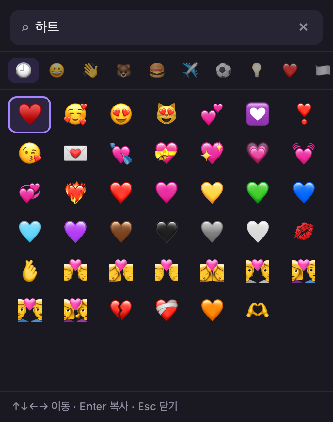

# 이모지 — 한국어 검색 🔎😀

한글·영어로 빠르게 검색하고, 클릭 한 번으로 복사하는 **크롬 확장 프로그램**이에요.

`웃음`, `ㅋㅋ`, `하트`, `fire` 처럼 편하게 검색하세요. 브라우저 어디서든 툴바 아이콘을 누르면 이모지 패널이 열립니다.

<!-- 스크린샷을 넣으면 여기에 이미지를 추가하세요 -->
<!--  -->

## ✨ 특징

- **한국어 검색이 진짜 잘 돼요** — 이름·태그·슬랭까지 한국어로 정리해서, `ㅋㅋ`나 `하트` 같은 말로도 찾아집니다.
- **1,914개 이모지 수록**, 10개 분류(웃는 얼굴, 사람, 동물, 음식, 여행, 액티비티, 사물, 기호, 플래그).
- **키보드만으로 조작** — 방향키로 이동, `Enter`로 복사, `Esc`로 닫기.
- **최근 사용 기억** — 자주 쓰는 이모지가 위로 올라와요.
- **다크 모드 자동 지원** — 브라우저 테마에 맞춰 색이 바뀝니다.
- **가볍고 안전** — 외부 서버 통신 없음. 권한은 클립보드 쓰기(`clipboardWrite`) 하나뿐이에요.

## 🚀 설치 방법 (개발자 모드)

아직 크롬 웹스토어에 올라가 있지 않아서, 아래처럼 직접 불러오면 됩니다.

1. 이 저장소를 내려받아요. (`Code → Download ZIP` 또는 `git clone`)
2. 크롬 주소창에 `chrome://extensions` 를 입력해 확장 프로그램 페이지를 엽니다.
3. 오른쪽 위 **개발자 모드**를 켜요.
4. **압축해제된 확장 프로그램을 로드합니다** 버튼을 누르고, 내려받은 폴더를 선택합니다.
5. 툴바에 이모지 아이콘이 생기면 끝!

> 단축키: `Ctrl+Shift+E` (맥은 `Command+Shift+E`) 로도 패널을 열 수 있어요.

## ⌨️ 사용법

| 동작 | 방법 |
| --- | --- |
| 검색 | 검색창에 한글·영어 입력 (예: `웃음`, `ㅋㅋ`, `fire`, `하트`) |
| 이동 | `↑` `↓` `←` `→` 방향키 |
| 복사 | 이모지 클릭 또는 `Enter` |
| 지우기/닫기 | `Esc` (검색어 지우기 → 한 번 더 누르면 닫기) |

## 🗂️ 프로젝트 구조

```
emoji-finder/
├── manifest.json      # 확장 프로그램 설정 (Manifest V3)
├── popup.html         # 패널 UI
├── popup.css          # 스타일 (라이트/다크)
├── popup.js           # 검색·키보드·복사 로직
├── emoji-data.json    # 이모지 데이터 (이름·태그·한국어 슬랭)
└── icons/             # 툴바 아이콘 (16/48/128px)
```

### 검색 데이터 형식

`emoji-data.json` 의 이모지 하나는 이렇게 생겼어요.

```json
{
  "c": "😀",                       // 이모지 글자
  "g": 0,                          // 분류 인덱스 (groups 배열 기준)
  "en": "grinning face",           // 영어 이름
  "ek": ["smile", "happy", ...],   // 영어 태그
  "kn": "활짝 웃는 얼굴",            // 한국어 이름
  "kk": ["미소", "웃음", ...]        // 한국어 태그 + 슬랭
}
```

검색 점수는 `이름 = 태그 > 부분일치` 순으로 매겨지고, 한국어 태그에 살짝 가중치를 줘서 한국어로 더 잘 잡히게 했어요. (`popup.js` 의 `score()` 참고)

## 🤝 기여

버그 제보, 이모지 태그 추가, 번역 개선 모두 환영해요! 이슈나 PR을 남겨 주세요.

특히 한국어 태그·슬랭은 사람마다 쓰는 말이 달라서, 여러분이 실제로 검색할 것 같은 단어를 `emoji-data.json` 의 `kk` 에 추가해 주시면 검색이 더 좋아집니다.

## 📄 라이선스

[MIT](LICENSE) — 자유롭게 쓰고, 고치고, 배포하셔도 됩니다.
